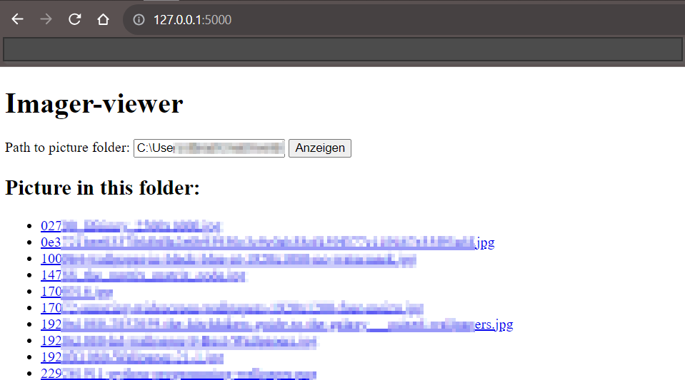
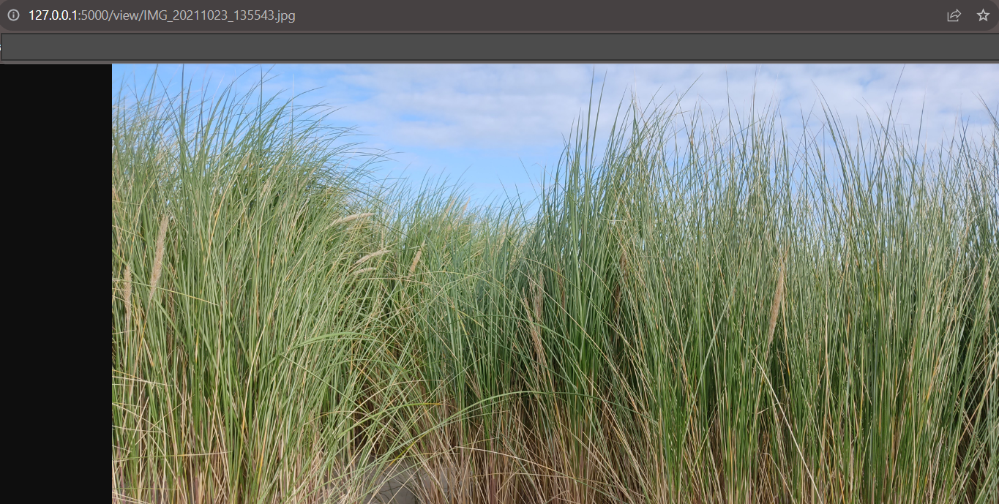

##Installation


Use the package manager [pip](https://pip.pypa.io/en/stable/) to install flask.

```bash
pip install flask
```

or use the requirements.txt

```bash
pip install -r requirements.txt
```


## Usage

Start app.py  go with your browser to :  http://127.0.0.1:5000 

add the path of your image folder to the website.

now you can open your image with a click



